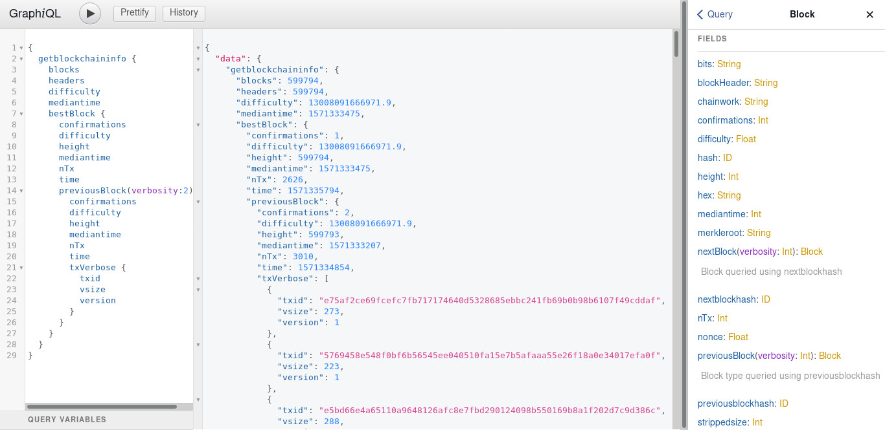

# BitcoinGQL
A GraphQL API for the Bitcoin JSON RPC.

## Setup
It is expected that you are running a fully indexed Bitcoin Core node (txindex=1) of version 0.18.1 or later with the RPC server enabled. Environment variables are required for RPC authentication, and currently, cookie authentication is not supported by BitcoinGQL.

### Running BitcoinGQL Using NodeJS
The environment variables can be set on the host or by creating text file named ".env" in the root directory and placing each one there (recommended). Please see the file .env_schema for an example.

```
RPC_USER=<rpcauth or rpcuser username>
RPC_PASS=<rpcauth or rpcpass password>
```

A remote host and port can also be configured if not using localhost or Bitcoin's RPC port default (8332):
```
RPC_HOST=<remote ip>
RPC_PORT=<port number>
```
Using the RPC server remotely will require special configuration of your Bitcoin JSON-RPC server. Please see the Bitcoin JSON-RPC documentation.

To make the GraphiQL IDE and documentation available, set the following:

```
GRAPHIQL=1
```


Other environment variables:
```
RESTRICT_HEAVY_QUERIES=0 # Set to 1 to lock out gettxoutsetinfo
VERIFY_CHAIN_LIMIT=1000 # Limits how many blocks deep verifychain is allowed to check
```

After variables are set or the .env file has been created, you can run the following to install dependencies, build the runtime, and start the server.

```
npm install;
npm run build;
npm run start;
```

The GraphQL API will be served at root from port 3000.

If you've enabled the GraphiQL IDE, you can browse to http://localhost:3000/btc-gql to use it and view the API documentation.

### Running as a Docker Container

From root directory:

```
docker build -t bitcoin-gql .
```

After the Docker image has been built, there are several ways to pass in the required environment variables when running it. To pass them in via command arguments, run the following replacing "username" and "password" with your RPC authentication credentials:

```
docker run \
  --network host \
  -e RPC_USER=<username> \
  -e RPC_PASS=<password> \
  <other optional environment variables...>\
  --name bitcoin-gql \
  bitcoin-gql
```

#### A Note About Networking
It is the default configuration for the Bitcoin JSON-RPC server to only allow connections from localhost, but it is Docker's default to expose the container to the network in bridge mode. The above command sets the container network to use the host machine's network so that the RPC is available to the container using localhost. This is the recommended way to interact with the Bitcoin JSON-RPC, but the Docker image can be run in bridge mode if your Bitcoin server is configured to allow remote connections.

To run the Docker container in bridge mode or on a remote host requires special Bitcoin JSON-RPC server configuration. Please see the Bitcoin Core documentation to learn how to expose the RPC server to remote clients. You should never communicate with a Bitcoin JSON-RPC server across untrusted networks.

## About the API
BitcoinGQL began as an attempt to closely model the methods available on the Bitcoin JSON-RPC. The root queries in BitcoinGQL share the same name and casing as their method counterpart in the Bitcoin JSON-RPC. In most cases, the field names and casing match those found in the Bitcoin JSON-RPC. Extra edges or fields that have been added which take advantage of many of the benefits that GraphQL offers are named using camelCase. Field types have been selected to closely represent and strictly type what is available from the Bitcoin JSON-RPC.

Not all of the methods offered by Bitcoin JSON-RPC are implemented in BitcoinGQL. Currently, only Blockchain, Network, and some Rawtransaction RPC method queries are available on BitcoinGQL. None of the mutation type methods have been implemented. Many edges and extra fields which are obvious relationships in the data have not been constructed, but they are planned. The intent was to lay a strong foundation before moving on.

Data mutations have intentionally been excluded, but maybe they will be added at some point.

## What's Needed
There are no depth controls for how far a query can drill down into connected types. Eventually, the RPC server can't accept new subtype requests.

## Warning
It's not recommended that you use this with a Bitcoin node that manages actual funds. Security cannot be guaranteed, and it is highly dependent on the network configuration of the Bitcoin client. I take no responsibility for loss of funds.
